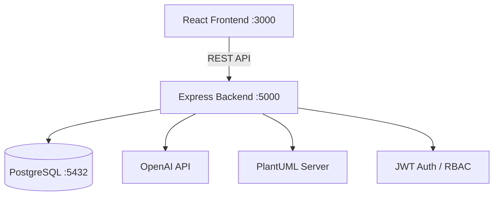

# RitHub


An AI-integrated, blind-evaluation platform for conducting rigorous, unbiased human-subject studies on software engineering artifacts.

## Why RitHub?

As Large Language Models increasingly generate code, diagrams, and documentation, evaluating the quality of these outputs has become critical — yet human evaluators are susceptible to **author bias** (scoring artifacts higher simply because they were produced by a famous model or a senior engineer). At the same time, LLM "hallucinations" — confident but incorrect outputs — demand rigorous, controlled testing. RitHub solves both problems by providing a **double-blind evaluation engine**: artifact authorship is completely hidden from participants, forcing evaluation purely on technical merit. Combined with AI-powered study tooling, RitHub drastically reduces the time required to architect and execute rigorous academic studies.

[Read the detailed architecture document →](./ARCHITECTURE.md)

## Table of Contents

- [Why RitHub?](#why-rithub)
- [Architecture](#architecture)
- [Requirements](#requirements)
- [First-Time Setup](#first-time-setup)
- [Running the Project](#running-the-project)
- [Verification](#verification)
- [Project Structure](#project-structure)
- [Design Decisions](#design-decisions)
- [Team](#team)
- [Troubleshooting](#troubleshooting)

## Architecture



Four roles: **Admin**, **Researcher**, **Reviewer**, **Participant** — each with distinct access controls.

## Requirements

- Docker and Docker Compose
- Node.js 18+ (for local development outside of Docker, optional)

## First-Time Setup

1. Clone the repository to your local machine.
2. Ensure you have Docker and Docker Compose installed and running.
3. **Configure Environment Variables:**
   - Copy `.env.example` to `.env` in the **project root** and fill in your secrets (`DB_PASSWORD`, `JWT_SECRET`, `EMAIL_USER`, `EMAIL_PASSWORD`, `POSTGRES_PASSWORD`, `OPENAI_API_KEY`, admin credentials).
   - Optionally copy `backend/.env.example` to `backend/.env` for local (non-Docker) development.
4. No manual database setup is required; the Docker Compose file will initialize the PostgreSQL database and run migrations automatically upon startup.

## Running the Project

The application is fully containerized. To start the backend, frontend, and database, run the following command in the root directory:

```bash
docker-compose build
docker-compose up -d
```

This will build the necessary images and start the containers in detached mode.

## Verification

Once the containers are running, you can verify everything works by navigating to the frontend application:

- **Frontend URL:** `http://localhost:3000`
- **Backend API:** `http://localhost:5000`

### Admin Login

Default admin credentials are configured via `ADMIN_USERNAME` and `ADMIN_PASSWORD` in the `.env` file (see `.env.example`).

## Project Structure

```text
.
├── backend/            # Node.js + Express backend API
├── database/           # Database initialization scripts and migrations
├── frontend/           # React.js frontend application
├── ARCHITECTURE.md     # Detailed project architecture and features
├── CHANGELOG.md        # Version history (Keep a Changelog format)
├── CONTRIBUTING.md     # Contribution guidelines
├── SECURITY.md         # Security policy
├── docker-compose.yml  # Docker Compose configuration
├── package.json        # Main project dependencies and scripts
└── README.md           # Project documentation (this file)
```

## Design Decisions

### Why PostgreSQL (not MongoDB)

Relational integrity matters for study lifecycle state machines and cross-table evaluation analytics. Studies move through a strict `Draft → Active → Completed → Archived` lifecycle, and relational constraints ensure data integrity at every transition. Aggregate queries across participants, evaluations, and criteria are naturally expressed in SQL.

### Why double-blind matters for LLM studies

Human evaluators consistently exhibit author bias — rating artifacts higher when they believe the author is an expert or a well-known AI model. Double-blind evaluation removes this confound entirely, forcing participants to judge artifacts solely on technical merit, logic, and clarity. This is especially important for studies comparing human-written and AI-generated code.

### Why soft-deletion

Deleting a study, quiz, or artifact does not destroy the underlying data; items are marked `is_deleted` and moved to a Trash Bin. This preserves referential integrity of completed study data — researchers can recover deleted artifacts without corrupting live statistics or participant progress metrics.

## Team

Developed as a team for CS319, Bilkent University, Fall 2025.

<!-- TODO: List teammates by name/GitHub handle once permission is confirmed. -->

## Troubleshooting

- **Ports already in use:** Ensure ports `3000`, `5000`, and `5432` are not being used by other applications.
- **Viewing Logs:** If something goes wrong, you can view the logs of the services by running `docker-compose logs -f`.
